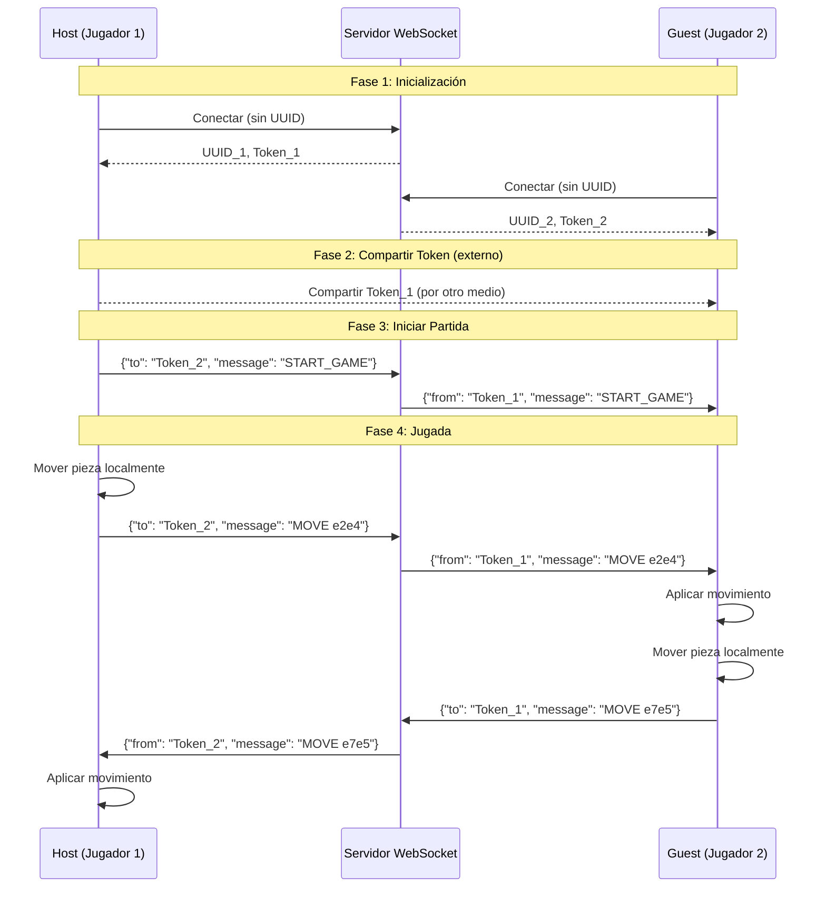

# Plan de Implementación: Juego de Ajedrez con WebSocket

## Contexto del Proyecto
- **Proyecto base**: Vite + Vue 3 ya configurado (`simple-websocket-chess`)
- **Servidor WebSocket**: Ya existe en `D:\simple-websocket-proxy\server.js` (corre en `wss://closer.click:4000`)
- **Arquitectura**: Aplicación híbrida que puede actuar como:
  - **Host**: Toma decisiones localmente y maneja la lógica del juego
  - **Guest**: Se conecta al host a través del servidor WebSocket proxy
- **Sistema de tokens**: El servidor provee tokens cortos alfanuméricos para identificación y comunicación

## Análisis del Servidor WebSocket Existente

### API del Servidor
1. **Conexión inicial**: `ws://closer.click:4000/` (sin parámetros) genera un nuevo UUID y token corto
2. **Reconexión**: `ws://closer.click:4000/?uuid=UUID_EXISTENTE` para reconectar con UUID previo
3. **Formato de mensajes**:
   ```json
   {
     "to": "TOKEN_CORTO_DESTINO",
     "message": "contenido del mensaje"
   }
   ```
4. **Respuestas del servidor**:
   - `connection_established`: Al conectar exitosamente
   - `message`: Cuando se recibe un mensaje de otro cliente
   - `message_sent`: Confirmación de envío exitoso
   - `error`: En caso de errores

### Flujo de Comunicación
1. Cliente A (host) se conecta → obtiene token corto (ej: "ABCD")
2. Cliente B (guest) se conecta → obtiene token corto (ej: "EFGH")
3. Host comparte su token con Guest (por cualquier medio externo)
4. Guest envía mensajes a Host usando `{"to": "ABCD", "message": "..."}`
5. Host recibe mensajes y puede responder usando `{"to": "EFGH", "message": "..."}`

## Requisitos del Juego de Ajedrez

### Componentes Principales
1. **Tablero de ajedrez interactivo** (8x8)
2. **Sistema de turnos** (blancas vs negras)
3. **Lógica de movimientos válidos** para cada pieza
4. **Estado del juego** (posición de piezas, turno actual, historial)
5. **Sincronización WebSocket** entre host y guest
6. **Interfaz de usuario** para modo host/guest

## Plan de Implementación

### Fase 1: Configuración y Estructura del Proyecto
- [ ] Actualizar `package.json` con dependencias necesarias
- [ ] Configurar variables de entorno (`.env`) para URL del WebSocket
- [ ] Crear estructura de directorios para componentes del juego
- [ ] Configurar TypeScript (opcional pero recomendado)

### Fase 2: Módulo de Conexión WebSocket
- [ ] Crear servicio `WebSocketService` para manejar conexiones
- [ ] Implementar reconexión automática con UUID almacenado
- [ ] Manejar eventos de conexión/desconexión
- [ ] Implementar sistema de mensajes con el formato del servidor
- [ ] Crear store de estado para tokens y conexión

### Fase 3: Lógica del Juego de Ajedrez
- [ ] Crear clase `ChessGame` con lógica de juego independiente
- [ ] Implementar reglas de movimiento para todas las piezas
- [ ] Manejar estados especiales (jaque, jaque mate, tablas)
- [ ] Crear sistema de historial de movimientos
- [ ] Implementar notación algebraica para movimientos

### Fase 4: Componentes Vue para la Interfaz
- [ ] Componente `ChessBoard`: Tablero interactivo 8x8
- [ ] Componente `ChessPiece`: Piezas visuales con drag & drop
- [ ] Componente `GameStatus`: Muestra turno, estado, reloj
- [ ] Componente `ConnectionPanel`: Para modo host/guest y tokens
- [ ] Componente `MoveHistory`: Lista de movimientos realizados

### Fase 5: Integración WebSocket + Juego
- [ ] Modo Host: Lógica local + enviar movimientos al guest
- [ ] Modo Guest: Recibir movimientos del host + enviar movimientos propios
- [ ] Sincronización de estado inicial del juego
- [ ] Manejo de reconexión y resincronización
- [ ] Sistema de confirmación de movimientos

### Fase 6: Funcionalidades Adicionales
- [ ] Sistema de invitación con tokens
- [ ] Chat integrado entre jugadores
- [ ] Temporizador de juego opcional
- [ ] Guardar/recuperar partidas
- [ ] Responsive design para móviles

## Estructura de Archivos Propuesta

```
src/
├── services/
│   ├── WebSocketService.js      # Conexión y comunicación WebSocket
│   └── ChessGameService.js      # Lógica del juego
├── stores/
│   └── gameStore.js            # Estado global del juego
├── components/
│   ├── chess/
│   │   ├── ChessBoard.vue      # Tablero principal
│   │   ├── ChessPiece.vue      # Piezas individuales
│   │   ├── GameControls.vue    # Controles del juego
│   │   └── MoveHistory.vue     # Historial de movimientos
│   ├── connection/
│   │   ├── ConnectionPanel.vue # Panel de conexión
│   │   └── TokenShare.vue      # Compartir token
│   └── ui/
│       └── GameStatus.vue      # Estado del juego
├── utils/
│   ├── chessRules.js           # Reglas del ajedrez
│   └── chessNotation.js        # Notación algebraica
└── App.vue                     # Componente principal
```

## Diagrama de Flujo de Comunicación



## Consideraciones Técnicas

### Almacenamiento Local
- Guardar UUID en `localStorage` para reconexiones automáticas
- Guardar token del oponente para comunicación
- Guardar estado de partida en curso

### Manejo de Errores
- Reconexión automática en caso de desconexión
- Validación de movimientos antes de enviar
- Confirmación de recepción de movimientos
- Timeout para respuestas

### Seguridad
- Los tokens son efímeros (10 minutos de inactividad)
- Validación de IP en el servidor
- No hay autenticación adicional (solo tokens)

### Performance
- Minimizar mensajes WebSocket (solo movimientos, no estado completo)
- Actualización optimista de la UI
- Debouncing para movimientos rápidos

## Próximos Pasos Inmediatos

1. **Revisar y aprobar este plan**
2. **Actualizar dependencias del proyecto**
3. **Implementar servicio WebSocket básico**
4. **Crear tablero de ajedrez estático**
5. **Implementar lógica básica de movimientos**

## Preguntas Pendientes

1. ¿Prefieres usar TypeScript o JavaScript puro?
2. ¿Necesitas soporte para múltiples idiomas?
3. ¿Quieres implementar características avanzadas como enroque, captura al paso, etc.?
4. ¿Prefieres un diseño visual específico (moderno, clásico, minimalista)?
5. ¿Necesitas integración con algún sistema de cuentas de usuario?