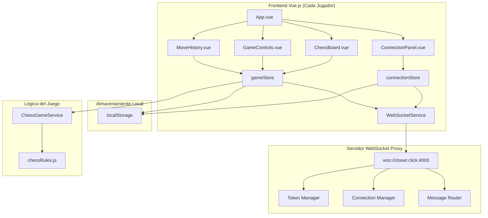
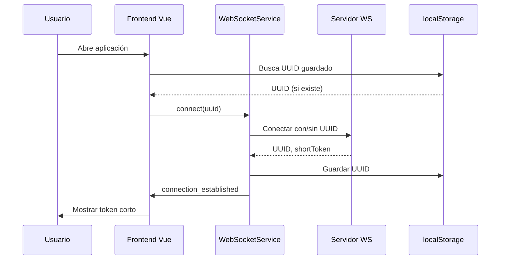
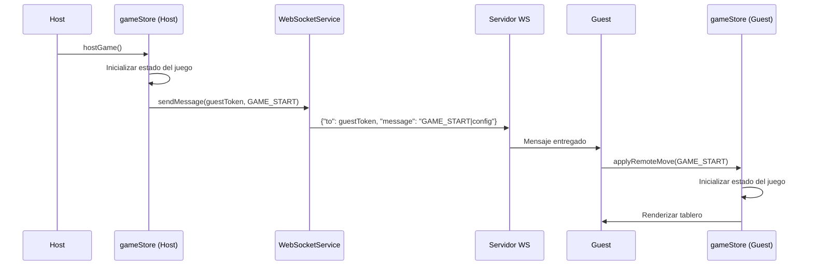
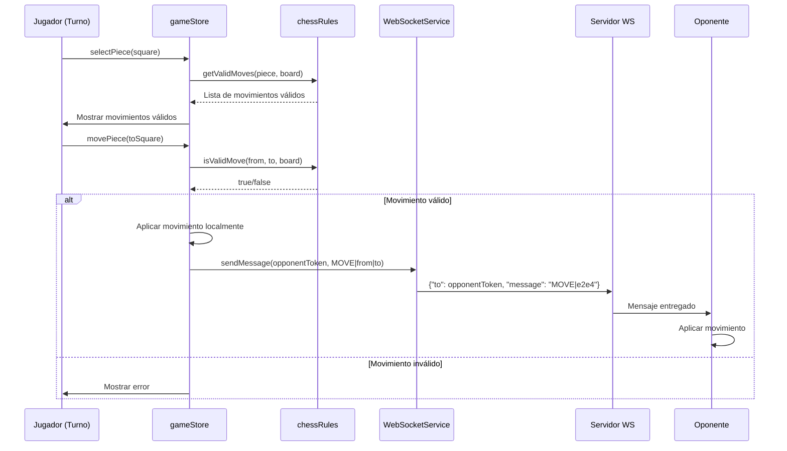

# Diagrama de Arquitectura del Sistema

## Vista General del Sistema



## Flujo de Datos Detallado

### 1. Inicialización de Conexión


### 2. Inicio de Partida (Modo Host)


### 3. Movimiento de Pieza


## Estructura de Componentes Vue

### Jerarquía de Componentes
```
App.vue
├── ConnectionPanel.vue
│   ├── TokenDisplay.vue
│   ├── TokenInput.vue
│   └── ConnectionStatus.vue
├── ChessBoard.vue
│   ├── ChessSquare.vue (64 instancias)
│   │   └── ChessPiece.vue (0-1 por square)
├── GameControls.vue
│   ├── NewGameButton.vue
│   ├── SurrenderButton.vue
│   └── TimerDisplay.vue (opcional)
├── MoveHistory.vue
└── GameChat.vue (opcional)
```

### Stores Pinia
```
stores/
├── connectionStore.js
│   ├── state: uuid, shortToken, opponentToken, isConnected
│   ├── getters: connectionStatus, hasOpponent
│   └── actions: connect, disconnect, sendMessage
└── gameStore.js
    ├── state: board, currentTurn, selectedPiece, gameStatus
    ├── getters: isMyTurn, validMoves, winner
    └── actions: selectPiece, movePiece, resetGame, applyRemoteMove
```

## Modelo de Datos

### Estado del Tablero
```javascript
// Representación del tablero 8x8
board = [
  ['r', 'n', 'b', 'q', 'k', 'b', 'n', 'r'], // fila 8 (negras)
  ['p', 'p', 'p', 'p', 'p', 'p', 'p', 'p'], // fila 7
  [' ', ' ', ' ', ' ', ' ', ' ', ' ', ' '], // fila 6
  [' ', ' ', ' ', ' ', ' ', ' ', ' ', ' '], // fila 5
  [' ', ' ', ' ', ' ', ' ', ' ', ' ', ' '], // fila 4
  [' ', ' ', ' ', ' ', ' ', ' ', ' ', ' '], // fila 3
  ['P', 'P', 'P', 'P', 'P', 'P', 'P', 'P'], // fila 2 (blancas)
  ['R', 'N', 'B', 'Q', 'K', 'B', 'N', 'R']  // fila 1
]

// Notación de piezas:
// Mayúsculas = blancas, Minúsculas = negras
// R/r: Torre, N/n: Caballo, B/b: Alfil, Q/q: Reina, K/k: Rey, P/p: Peón
```

### Mensajes WebSocket
```javascript
// Formato base (requerido por el servidor)
{
  "to": "ABCD",      // Token corto del destinatario
  "message": "payload" // Contenido específico del juego
}

// Tipos de mensajes del juego:
// GAME_START|color|timestamp
// MOVE|from|to|promotion? (ej: "MOVE|e2|e4")
// CHAT|message_text
// GAME_END|reason|winner
// SYNC|board_state (para resincronización)
```

## Consideraciones de Diseño

### Separación de Responsabilidades
1. **WebSocketService**: Solo maneja conexión y transporte de mensajes
2. **gameStore**: Maneja estado del juego y lógica de UI
3. **chessRules**: Lógica pura de ajedrez (sin estado)
4. **Componentes Vue**: Solo presentación y interacción del usuario

### Patrones Utilizados
- **Store Pattern**: Pinia para estado global
- **Service Pattern**: Servicios para lógica de negocio
- **Component Composition**: Componentes Vue reutilizables
- **Observer Pattern**: Eventos WebSocket y reacciones de store

### Manejo de Estado
- Estado local del componente: Solo UI temporal
- Estado global (store): Datos compartidos entre componentes
- Estado persistente (localStorage): Datos que sobreviven recargas
- Estado remoto: Sincronizado a través de WebSocket

## Decisiones de Implementación

### 1. Validación de Movimientos
- Opción A: Implementar desde cero en `chessRules.js`
- Opción B: Usar biblioteca `chess.js` (más robusta, menos control)
- **Recomendación**: Implementar básico primero, luego evaluar necesidad de biblioteca

### 2. Sincronización de Estado
- **Approach optimista**: Aplicar movimiento localmente inmediatamente, revertir si el host rechaza
- **Approack conservador**: Esperar confirmación del host antes de aplicar
- **Recomendación**: Approach optimista para mejor experiencia de usuario, con sistema de rollback

### 3. Manejo de Desconexiones
- Guardar estado completo del juego en localStorage
- Intentar reconexión automática
- Resincronizar estado al reconectar
- Timeout después de 30 segundos de desconexión

### 4. Responsive Design
- Breakpoints: móvil (<768px), tablet (768-1024px), desktop (>1024px)
- Tablero ajustable: tamaño máximo basado en viewport
- Orientación vertical en móviles: tablero arriba, controles abajo

## Métricas de Éxito

### Funcionales
- [ ] Conexión WebSocket estable
- [ ] Movimientos válidos de ajedrez
- [ ] Sincronización host-guest
- [ ] Reconexión automática
- [ ] Interfaz usable en móvil

### No Funcionales
- [ ] < 100ms de latencia para movimientos locales
- [ ] < 500ms de latencia para movimientos remotos
- [ ] < 3MB de bundle size inicial
- [ ] Carga inicial < 3 segundos
- [ ] Uso de memoria < 100MB

## Riesgos y Mitigaciones

| Riesgo | Impacto | Probabilidad | Mitigación |
|--------|---------|--------------|------------|
| Servidor WS offline | Alto | Media | Modo local de práctica, mensaje de error claro |
| Latencia alta | Medio | Alta | Indicador de latencia, movimiento optimista |
| Bugs en lógica de ajedrez | Medio | Media | Testing exhaustivo, usar biblioteca probada |
| Pérdida de conexión | Alto | Alta | Reconexión automática, guardado de estado |
| Compatibilidad navegador | Bajo | Baja | Polyfills para WebSocket, fallback a polling |

## Próximos Pasos

1. **Aprobación del plan** por el usuario
2. **Implementación de Fase 1** (Configuración)
3. **Implementación de Fase 2** (WebSocket básico)
4. **Implementación de Fase 3** (Tablero estático)
5. **Iteración y refinamiento** basado en feedback