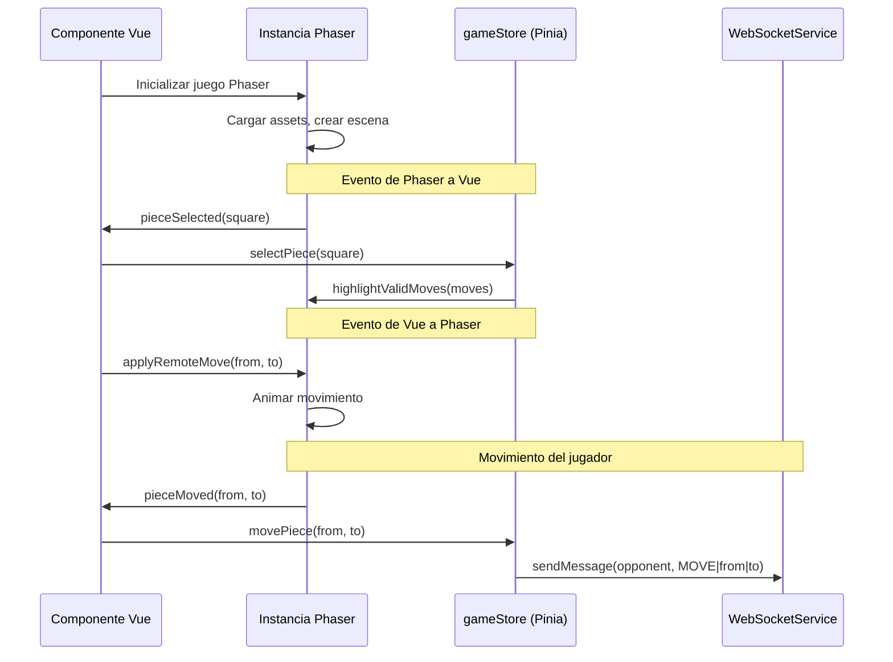

# Plan de Integración con Phaser para el Tablero de Ajedrez

## Cambios Arquitectónicos Principales

### 1. Phaser como Motor de Juego
- **Phaser 3** para renderizado del tablero y piezas
- **Canvas/WebGL** en lugar de DOM para mejor performance
- **Física y animaciones** integradas
- **Gestión de escenas** para diferentes estados del juego

### 2. Integración Vue + Phaser
- Vue maneja la UI general (paneles, controles, conexión)
- Phaser maneja el tablero interactivo dentro de un componente Vue
- Comunicación bidireccional entre Vue y Phaser

## Estructura Actualizada

### Componentes Principales
```
App.vue
├── ConnectionPanel.vue (Vue)
├── ChessGameScene.vue (Wrapper Vue para Phaser)
│   └── Phaser Game Instance
│       ├── Boot Scene (carga de assets)
│       ├── MainMenu Scene (menú principal)
│       ├── ChessBoard Scene (tablero de juego)
│       └── GameOver Scene (fin de partida)
├── GameControls.vue (Vue)
├── MoveHistory.vue (Vue)
└── GameChat.vue (Vue)
```

### Flujo de Comunicación Vue ↔ Phaser


## Actualización de la Lista de Tareas

### Fase Modificada: Componentes de la Interfaz (ahora con Phaser)

#### 4.1 Configurar Phaser en el Proyecto
- [ ] Instalar Phaser: `npm install phaser`
- [ ] Configurar TypeScript para Phaser (si se usa TS)
- [ ] Crear directorio `src/phaser/` para código Phaser
- [ ] Configurar carga de assets (sprites, sonidos)

#### 4.2 Componente Vue Wrapper para Phaser
- [ ] Crear `src/components/chess/PhaserChessGame.vue`:
  - Contenedor `<div>` para el canvas de Phaser
  - Inicialización y destrucción de instancia Phaser
  - Comunicación con stores Pinia
  - Manejo de resize del viewport

#### 4.3 Escenas Phaser
- [ ] Crear `src/phaser/scenes/BootScene.js`:
  - Precarga de assets (sprites de piezas, tablero, sonidos)
  - Configuración inicial del juego
- [ ] Crear `src/phaser/scenes/ChessBoardScene.js`:
  - Renderizado del tablero 8x8
  - Sprites de piezas posicionadas
  - Sistema de input (click/drag & drop)
  - Animaciones de movimiento
  - Resaltado de casillas válidas
- [ ] Crear `src/phaser/scenes/MainMenuScene.js` (opcional):
  - Menú principal del juego
  - Opciones de configuración

#### 4.4 Assets y Sprites
- [ ] Crear/obtener sprites para piezas de ajedrez (blancas/negras)
- [ ] Crear sprite del tablero o generarlo proceduralmente
- [ ] Assets para efectos visuales (resaltado, movimiento)
- [ ] Sonidos para movimientos, capturas, jaque

#### 4.5 Sistema de Input Phaser
- [ ] Implementar `pointerdown` para seleccionar piezas
- [ ] Implementar `pointerup` para soltar/mover piezas
- [ ] Implementar `pointermove` para arrastrar piezas
- [ ] Zonas interactivas para cada casilla

#### 4.6 Animaciones y Efectos
- [ ] Animación suave de movimiento de piezas
- [ ] Efectos visuales para casillas válidas/inválidas
- [ ] Animación de captura de piezas
- [ ] Efectos para jaque/jaque mate

## Integración Técnica Detallada

### Inicialización de Phaser en Vue
```javascript
// En PhaserChessGame.vue
import Phaser from 'phaser';
import ChessBoardScene from '@/phaser/scenes/ChessBoardScene';

export default {
  mounted() {
    const config = {
      type: Phaser.AUTO,
      parent: this.$refs.gameContainer,
      width: 800,
      height: 800,
      scene: [ChessBoardScene],
      scale: {
        mode: Phaser.Scale.FIT,
        autoCenter: Phaser.Scale.CENTER_BOTH
      }
    };
    
    this.game = new Phaser.Game(config);
    
    // Pasar referencia al store
    this.game.registry.set('gameStore', this.gameStore);
  },
  
  beforeUnmount() {
    if (this.game) {
      this.game.destroy(true);
    }
  }
}
```

### Comunicación Vue → Phaser
```javascript
// Método en componente Vue para aplicar movimiento remoto
applyRemoteMove(from, to) {
  const scene = this.game.scene.getScene('ChessBoardScene');
  if (scene && scene.movePiece) {
    scene.movePiece(from, to, true); // true = movimiento remoto (sin input)
  }
}

// En el store, escuchar cambios y notificar a Phaser
gameStore.$subscribe((mutation, state) => {
  if (mutation.type === 'applyRemoteMove') {
    // Notificar al componente Phaser
    vueComponent.applyRemoteMove(state.lastMove.from, state.lastMove.to);
  }
});
```

### Comunicación Phaser → Vue
```javascript
// En ChessBoardScene.js (Phaser)
class ChessBoardScene extends Phaser.Scene {
  create() {
    // Obtener referencia al store
    this.gameStore = this.registry.get('gameStore');
    
    // Configurar eventos de input
    this.input.on('gameobjectdown', (pointer, gameObject) => {
      const square = gameObject.getData('square');
      
      // Notificar al store Vue
      this.gameStore.selectPiece(square);
    });
  }
  
  // Método llamado desde Vue
  movePiece(from, to, isRemote = false) {
    // Animar movimiento
    const piece = this.getPieceAt(from);
    this.tweens.add({
      targets: piece,
      x: this.getSquarePosition(to).x,
      y: this.getSquarePosition(to).y,
      duration: 300,
      ease: 'Power2'
    });
    
    if (!isRemote) {
      // Notificar a Vue que el jugador movió
      this.gameStore.movePiece(from, to);
    }
  }
}
```

## Ventajas de Usar Phaser

### 1. Performance
- Renderizado WebGL/Canvas más eficiente que DOM
- Batch rendering para múltiples sprites
- Animaciones hardware-aceleradas

### 2. Características de Juego
- Sistema de física integrado (no necesario para ajedrez pero útil)
- Sistema de partículas para efectos visuales
- Gestión de audio avanzada
- Sistema de tweening para animaciones

### 3. Cross-platform
- Funciona bien en móviles (touch input)
- Escalado automático a diferentes resoluciones
- Soporte para diferentes navegadores

### 4. Experiencia de Usuario
- Animaciones suaves de movimiento
- Efectos visuales atractivos
- Feedback táctil/visual inmediato
- Transiciones entre estados del juego

## Consideraciones Específicas para Ajedrez con Phaser

### Representación del Tablero
- **Opción A**: Sprite único del tablero
- **Opción B**: 64 sprites individuales (casillas)
- **Opción C**: Generación procedural con gráficos
- **Recomendación**: Sprite único + overlays para resaltado

### Sistema de Coordenadas
- Mapear coordenadas de ajedrez (a1-h8) a posiciones Phaser
- Sistema de grid 8x8 para posicionamiento
- Conversión entre notación algebraica y coordenadas de píxeles

### Gestión de Estado
- Phaser mantiene estado visual (posición de sprites)
- Vue/Pinia mantiene estado lógico (posición de piezas, turno)
- Sincronización bidireccional

### Input Handling
- **Desktop**: Mouse click/drag
- **Móvil**: Touch input con gestos
- **Accesibilidad**: Alternativas para usuarios sin mouse/touch

## Actualización del Plan de Implementación

### Fase 1: Configuración (Modificada)
- [ ] Instalar Phaser: `npm install phaser`
- [ ] Configurar assets en `public/assets/`
- [ ] Crear estructura de directorios Phaser

### Fase 2: WebSocket (Sin cambios)
- [ ] WebSocketService básico
- [ ] connectionStore con Pinia

### Fase 3: Lógica de Ajedrez (Sin cambios)
- [ ] chessRules.js o chess.js
- [ ] gameStore con estado del juego

### Fase 4: Phaser Integration (Nueva)
- [ ] Componente wrapper Vue para Phaser
- [ ] Escena BootScene (carga de assets)
- [ ] Escena ChessBoardScene (tablero interactivo)
- [ ] Sistema de input y animaciones
- [ ] Comunicación Vue ↔ Phaser

### Fase 5: Integración Completa
- [ ] Conectar movimientos Phaser → WebSocket
- [ ] Aplicar movimientos remotos en Phaser
- [ ] Sincronización de estado

### Fase 6: UI Vue (Modificada)
- [ ] Componentes Vue alrededor del canvas Phaser
- [ ] Controles, historial, chat
- [ ] Responsive design que incluya el canvas

## Assets Necesarios

### Sprites (mínimo)
1. Piezas de ajedrez (blancas y negras, 6 tipos cada una = 12 sprites)
2. Tablero de ajedrez (sprite completo o tiles)
3. Overlays para resaltado (casillas válidas, seleccionada)

### Sonidos (opcional pero recomendado)
1. Movimiento de pieza
2. Captura de pieza
3. Jaque
4. Jaque mate
5. Notificación de turno

### Fuentes
1. Fuente para notación algebraica
2. Fuente para UI Vue

## Configuración de Build

### Vite + Phaser
```javascript
// vite.config.js
export default {
  // Configuración existente...
  build: {
    // Asegurar que los assets de Phaser se incluyan
    assetsInlineLimit: 4096 // 4kb
  }
}
```

### Optimización de Assets
- Sprites en atlas (spritesheet) para reducir requests
- Compresión de imágenes (WebP + fallback PNG)
- Lazy loading de assets no críticos

## Próximos Pasos Inmediatos

1. **Instalar Phaser** y configurar proyecto
2. **Crear componente wrapper** Vue para Phaser
3. **Implementar escena básica** con tablero estático
4. **Añadir sprites** de piezas y tablero
5. **Implementar input básico** (seleccionar/mover piezas)
6. **Conectar con stores** Vue para lógica del juego

## Preguntas para el Usuario

1. ¿Tienes assets (sprites, sonidos) específicos que quieras usar o prefieres que genere assets básicos?
2. ¿Quieres características visuales específicas (estilo de tablero, animaciones)?
3. ¿Necesitas soporte para tablets además de desktop/móvil?
4. ¿Prefieres un enfoque más minimalista o con muchos efectos visuales?