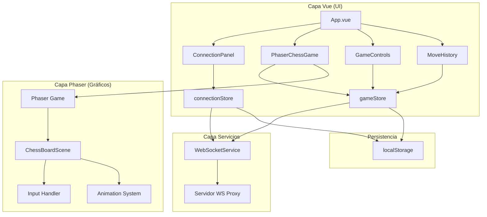

# Lista de Tareas Final: Ajedrez con Vue + Phaser + WebSocket

## Resumen del Cambio Arquitectónico
- **Frontend**: Vue 3 + Vite (ya configurado)
- **Motor de Juego**: Phaser 3 para tablero interactivo
- **Comunicación**: WebSocket con servidor proxy existente
- **Estado**: Pinia para gestión de estado global
- **Integración**: Vue maneja UI, Phaser maneja tablero gráfico

## Fase 1: Configuración del Proyecto (Día 1)

### 1.1 Instalar Dependencias
- [ ] `npm install phaser` - Motor de juego
- [ ] `npm install pinia` - Gestión de estado (si no está)
- [ ] `npm install uuid` - Generación de IDs únicos
- [ ] Actualizar `package.json` con nuevas dependencias

### 1.2 Configurar Estructura
- [ ] Crear `src/phaser/` directorio
  - `scenes/` - Escenas Phaser
  - `assets/` - Sprites y sonidos
  - `utils/` - Utilidades Phaser
- [ ] Crear `src/stores/` para stores Pinia
- [ ] Crear `src/services/` para servicios

### 1.3 Configurar Variables
- [ ] Crear `.env` con `VITE_WS_URL=wss://closer.click:4000`
- [ ] Configurar TypeScript si se decide usarlo

## Fase 2: Servicio WebSocket (Día 1-2)

### 2.1 WebSocketService
- [ ] Crear `src/services/WebSocketService.js`:
  - Conexión al servidor existente
  - Manejo de reconexión con UUID
  - Formato de mensajes `{to, message}`
  - Eventos: connect, disconnect, message

### 2.2 Store de Conexión
- [ ] Crear `src/stores/connectionStore.js` (Pinia):
  - Estado: `uuid`, `shortToken`, `isConnected`, `opponentToken`
  - Acciones: `connect()`, `disconnect()`, `sendMessage()`
  - Persistir UUID en localStorage

### 2.3 Componente de Conexión
- [ ] Crear `src/components/ConnectionPanel.vue`:
  - Mostrar token corto asignado
  - Campo para token del oponente
  - Estado de conexión visual

## Fase 3: Lógica de Ajedrez (Día 2)

### 3.1 Reglas del Juego
- [ ] Crear `src/utils/chessRules.js`:
  - Representación del tablero 8x8
  - Movimientos válidos por pieza
  - Reglas especiales (enroque, promoción, etc.)
  - Validación de jaque/jaque mate

### 3.2 Store del Juego
- [ ] Crear `src/stores/gameStore.js` (Pinia):
  - Estado: `board`, `currentTurn`, `gameStatus`
  - Acciones: `selectPiece()`, `movePiece()`, `applyRemoteMove()`
  - Getters: `isMyTurn`, `validMoves`, `winner`

### 3.3 Protocolo de Mensajes
- [ ] Definir formatos en `src/utils/gameProtocol.js`:
  - `GAME_START|color|timestamp`
  - `MOVE|from|to|promotion?`
  - `CHAT|message`
  - `GAME_END|reason`

## Fase 4: Integración Phaser (Día 3-4)

### 4.1 Componente Wrapper Vue
- [ ] Crear `src/components/PhaserChessGame.vue`:
  - Contenedor para canvas Phaser
  - Inicialización/destrucción de juego
  - Comunicación con stores

### 4.2 Escenas Phaser
- [ ] `src/phaser/scenes/BootScene.js`:
  - Precarga de assets (sprites, sonidos)
- [ ] `src/phaser/scenes/ChessBoardScene.js`:
  - Renderizado tablero 8x8
  - Sprites de piezas posicionadas
  - Sistema de input (click/drag)
  - Animaciones de movimiento

### 4.3 Assets Gráficos
- [ ] Crear/obtener sprites para:
  - Piezas de ajedrez (blancas/negras, 6 tipos)
  - Tablero de ajedrez
  - Overlays para resaltado
- [ ] Configurar carga en Phaser

### 4.4 Sistema de Input
- [ ] Implementar selección de piezas (pointerdown)
- [ ] Implementar arrastre de piezas (pointermove/up)
- [ ] Validación visual de movimientos

## Fase 5: Integración Completa (Día 4-5)

### 5.1 Comunicación Vue ↔ Phaser
- [ ] Eventos Phaser → Vue (pieza seleccionada/movida)
- [ ] Métodos Vue → Phaser (aplicar movimiento remoto)
- [ ] Sincronización de estado visual/lógico

### 5.2 Flujo Host-Guest
- [ ] Modo Host: Iniciar juego, validar movimientos
- [ ] Modo Guest: Unirse, enviar movimientos para validación
- [ ] Sincronización de estado inicial

### 5.3 Manejo de Errores
- [ ] Reconexión WebSocket automática
- [ ] Resincronización después de desconexión
- [ ] Validación de movimientos inválidos

## Fase 6: UI Vue y Controles (Día 5)

### 6.1 Componentes de UI
- [ ] `GameControls.vue`: Botones nuevo juego, rendirse, etc.
- [ ] `MoveHistory.vue`: Historial en notación algebraica
- [ ] `GameStatus.vue`: Turno actual, estado del juego
- [ ] `GameChat.vue`: Chat entre jugadores (opcional)

### 6.2 Layout Responsive
- [ ] Diseño para desktop (>1024px)
- [ ] Diseño para tablet (768-1024px)
- [ ] Diseño para móvil (<768px)
- [ ] Canvas Phaser que se ajusta al viewport

### 6.3 Estilos y Temas
- [ ] CSS para componentes Vue
- [ ] Temas claro/oscuro (opcional)
- [ ] Estilos consistentes con Phaser

## Fase 7: Testing y Depuración (Día 6)

### 7.1 Testing Básico
- [ ] Probar conexión WebSocket local/remota
- [ ] Probar movimientos básicos de ajedrez
- [ ] Probar flujo completo host-guest
- [ ] Probar en diferentes dispositivos

### 7.2 Depuración
- [ ] Panel de debug para mensajes WebSocket
- [ ] Log de eventos del juego
- [ ] Herramientas de desarrollo Phaser

### 7.3 Optimización
- [ ] Performance del canvas Phaser
- [ ] Tamaño del bundle final
- [ ] Tiempos de carga de assets

## Fase 8: Documentación y Despliegue (Día 7)

### 8.1 Documentación
- [ ] Actualizar `README.md` con instrucciones
- [ ] Documentar protocolo de mensajes
- [ ] Guía de usuario básica

### 8.2 Build de Producción
- [ ] Configurar `vite.config.js` para Phaser
- [ ] Optimizar assets (compresión, spritesheets)
- [ ] Ejecutar `npm run build`
- [ ] Verificar funcionamiento en producción

### 8.3 Despliegue
- [ ] Desplegar en servicio estático (Netlify, Vercel, GitHub Pages)
- [ ] Configurar dominio si es necesario
- [ ] SSL para WebSocket (wss://)

## Prioridades y MVP

### MVP (Producto Mínimo Viable)
1. ✅ Conexión WebSocket básica
2. ✅ Tablero Phaser con piezas
3. ✅ Movimientos básicos (sin validación completa)
4. ✅ Comunicación host-guest simple
5. ✅ Interfaz mínima funcional

### Características Post-MVP
1. Validación completa de reglas de ajedrez
2. Reglas especiales (enroque, promoción, etc.)
3. Sistema de chat integrado
4. Temporizador de juego
5. Historial de partidas
6. Múltiples temas visuales

## Diagrama de Flujo Final

## Consideraciones Técnicas Clave

### 1. Comunicación Vue-Phaser
- **Phaser → Vue**: Eventos personalizados o llamadas directas al store
- **Vue → Phaser**: Métodos públicos en la escena o registry

### 2. Performance
- Phaser usa WebGL para renderizado eficiente
- Minimizar re-renders de Vue con computed properties
- Lazy loading de assets no críticos

### 3. Responsive Design
- Phaser Scale Manager para ajustar canvas
- Media queries en CSS para componentes Vue
- Orientación vertical/horizontal en móviles

### 4. Cross-browser
- Phaser tiene buen soporte cross-browser
- Polyfills para características modernas si es necesario
- Fallbacks para navegadores sin WebGL

## Próximos Pasos Inmediatos

1. **Aprobación final** del plan
2. **Instalar Phaser** y dependencias
3. **Crear componente wrapper** Vue para Phaser
4. **Implementar escena básica** con tablero estático
5. **Conectar con WebSocketService**

## Preguntas Finales

1. ¿El plan actual con Phaser cumple con tus expectativas?
2. ¿Hay alguna característica específica que quieras priorizar?
3. ¿Prefieres que comience la implementación ahora?